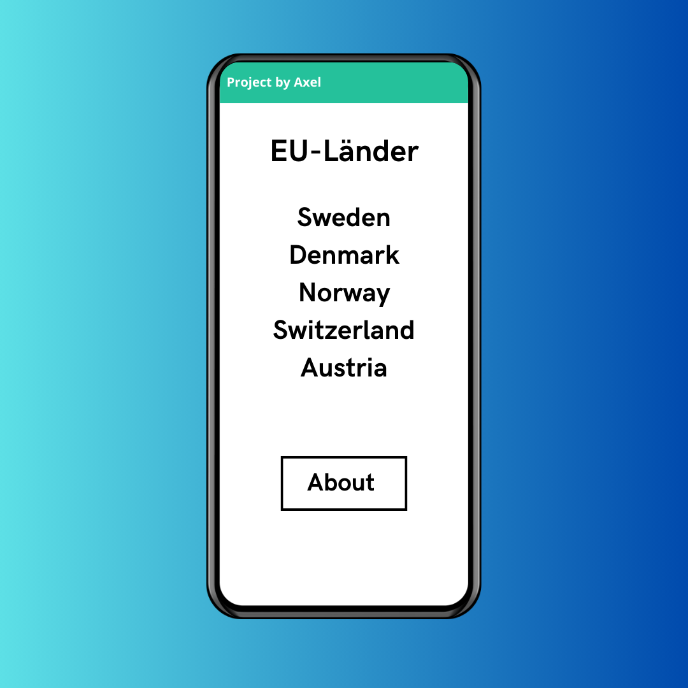
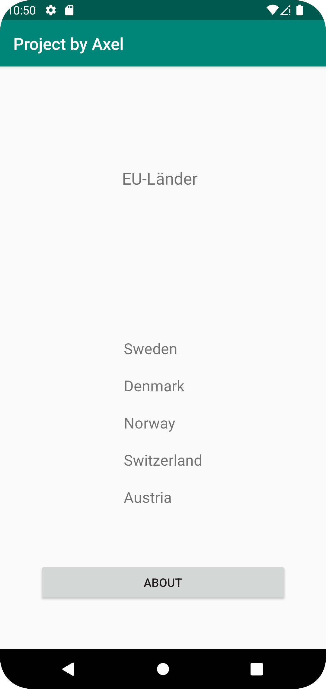
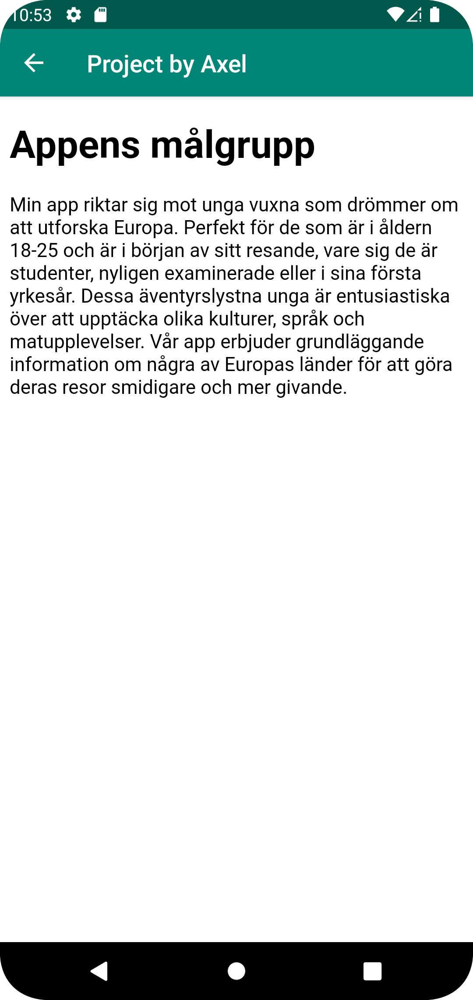

# Rapport
# Skiss/Design-Idé
Projektet började med att en skiss skapades på hur appen skulle se ut vid slutet av projektet.
Skissen innehåller en rubrik för att specificera vad de olika JSON-Data i recyclerviewen representerar
samt JSON-Datan och slutligen en knapp för about aktiviteten.
Bilden på skissen finns bifogad som bild 1.
# Webbtjänst - JSON
Jag valde att skapa data i form av länder där de olika attribut som finns är; ID, Namn, Plats(Kontinent),
Cost(Gdp i miljarder usd) och Size(km^2). Detta laddades upp mot den admin-länk som fanns listad i canvas.
Detta är koden i prettified JSON:
{"ID":"a23axehe_001","name":"Sweden","type":"a23axehe","company":"","location":"Europe","category":"","size":450295,"cost":591,"auxdata":""}
# Implementationsexempel
För att göra uppgiften hittades inspiration i de två uppgifter som tidgare gjorts. Detta ledde till att
det första som gjordes var att filen "JsonTask.java" från assignment 5 lades till. 
Efter att JsonTask lagts till skapades en klass för länderna, filen döptes till Country. I country klassen kan den kod som finns bifogad som figur 1 hittas.
Det som händer i koden från figur 1 är att en konstruktör för en country skapas, konstruktören innehåller alla de attribut som i webbtjänsten
definerades för ett JSON-Objekt. Den sista metoden toString() används för att returnera namnet på varje land. Denna metod körs när länderna ska visas i recyclerviewen 
samt är det den som körs när onClickListener registrerar ett klick på någon av länderna. Denna commit-länk på github visar hur jag anpassade den tidigare använda klassen från 
assignment 5 och gjorde att den passade detta program:
https://github.com/a23axehe/mobileapp-programming-project/commit/17cd63610b366e4bda7c2e780be081e27f9ed684#diff-fa63cc5f58ca19a1bebcdc0f004a5eeef988975f4e74b761226a41f22e3edab3
Efter att country klassen skapats skapades en adapter klass inspirerad  utifrån assignment 5. Det som gjordes med denna adapter klass var att byta ut de gamla variablera
vilket i detta fall var "Mountain" och "Recyclerviewitem" till den nyskapade klassen Country.
Sedan skrevs kod i Mainactivity.java vilket påverkade hur JSON-datan hämtades och sparades i variablar. Den första tanken samt målet med uppgiften var att
göra detta genom att ladda ner JSON-datan från en url. Pågrund av skolans brandväggar gick tyvärr denna plan ej att genomföra. Istället skapades filen
countries.json där den JSON-data som lagrats i url:en sparades. I Mainactivity gjorde detta dock inte så mycket skillnad. Det som gjordes i mainactivity.java
var att programmet laddade ner JSON-datan från filen countries.json genom koden från figur 2.
Sedan lades json-objekten in i en array(countries) samtidigt som programmet hämtade de olika attribut från objekten. Allt detta gjordes genom koden från figur 3.
För att skapa en andra aktivitet togs inspiration från assignment 4. Först adderades an button till layout filen för mainactivity. I mainactivity hämtades sedan knappen
via sitt id och tilldelades en variabel. Denna variabel tilldelades sedan en onClickListener. När onClickListener aktiverades skapades en ny intent som startade aboutactivity. 
Allt detta gjordes genom koden i figur 4. I about-activity skapades sedan en webview som hänvisade till den interna
webbsidan about.html. Detta gjordes genom kodsnuttarna i figur 5.
# Reflektion
Jag tycker att det var en intressant uppgift som var någorlunda utmanande. Den var intressant tack vare att det var en bra summering
på de inlämningsuppgifter vid gjort tidigare i kursen. Detta innebar även att man kunde återvinna den kod som skapats i tidigare uppgifter.
Återvinningen av kod gjorde projektet lite enklare, dock krävdes det samtidigt att man förstod den kod som skapats
för att kunna anpassa den efter den uppgift som fanns i projektet. Något som jag saknade var att få använda url:en
för att hämta JSON-datan. Det fungerade inte i uppgift 5 eller projektet pågrund av skolans brandväggar. Som tur var 
fungerar det att skapa en json fil inom projektet istället.
## Kodsnuttar
Figur 1:
public Country(String id, String name, String type, String company, String location, String category, int size, int cost) {
this.id = id;
this.name = name;
this.type = type;
this.company = company;
this.location = location;
this.category = category;
this.size = size;
this.cost = cost;
}
@Override
public String toString() {
return name;
}
}

Figur 2:
private final String JSON_FILE = "Countries.json";
private void getJson() {
new Json_File(this, this).execute(JSON_FILE);
}

Figur 3:
try {
JSONArray jsonArray = new JSONArray(json);
for (int i = 0; i < jsonArray.length(); i++) {
JSONObject jsonObject = jsonArray.getJSONObject(i);
String id = jsonObject.getString("ID");
String name = jsonObject.getString("name");
String type = jsonObject.getString("type");
String company = jsonObject.getString("company");
String location = jsonObject.getString("location");
String category = jsonObject.getString("category");
int size = jsonObject.getInt("size");
int cost = jsonObject.getInt("cost");
Country country = new Country(id, name, type, company, location, category, size, cost);
countries.add(country);
}
} catch (JSONException e) {
e.printStackTrace();
}
return countries;
}

Figur 4:
Button secondActivityButton = findViewById(R.id.button);
secondActivityButton.setOnClickListener(new View.OnClickListener() {
@Override
public void onClick(View view) {
// Start the second activity
Intent intent = new Intent(MainActivity.this, AboutActivity.class);
startActivity(intent);
}
});
}

Figur 5:
public void showInternalWebPage() { aboutWebView.loadUrl("file:///android_asset/about.html"); }
...
WebViewClient webViewClient = new aboutWebViewClient();
aboutWebView.setWebViewClient(webViewClient);
showInternalWebPage();
## Bilder/Screenshots
Bild 1 Skiss:

Bild 2 RecyclerView/MainActivity:

Bild 3 About:
